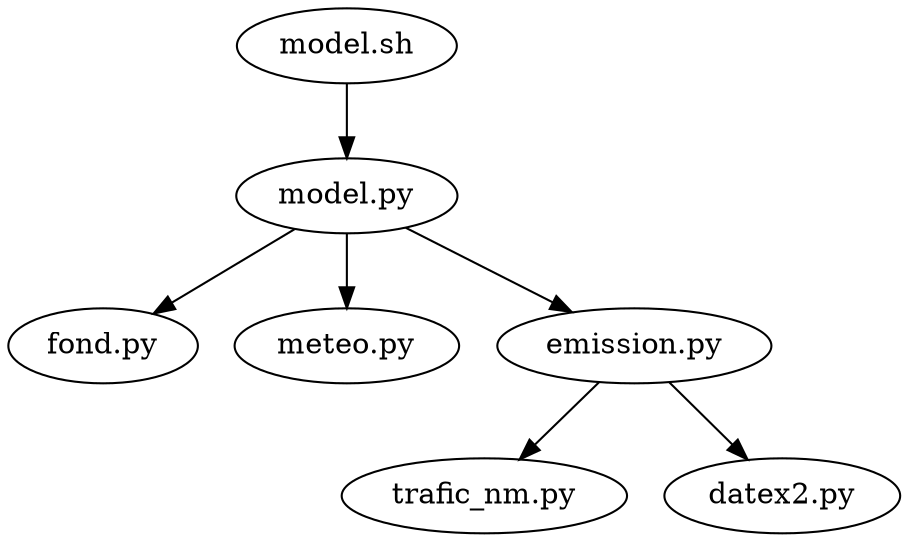

# captation

Scripts for the measurement team.

## Usage

* Copy the `config.ini.template` file to `config.ini` and fill in the required information.
* Install the dependencies as listed below
* Run the script

Call diagram:



## Configuration file

`nm_segment_map` is the name of the csv file (with header) which maps a NM traffic id to ids in the network file (RESEAU).

Here is a sample file. The 3rd column is superfluous
```csv
"ID_RESEAU,N,10,0","ID_Trafic,N,255,0","Distance,N,24,15"
73,310,"35,2928380149"
1028,7075,"27,232614794"
1062,2075,"12,267833312"
```

## Scripts

### meteo.py

**WARN:** The date values are in UTC and not GMT+1.

Generates a SIRANE weather input file from OpenWeatherMap data.

**Requirements:** requests, and a valid API key from [OpenWeatherMap](https://openweathermap.org/)

```sh
# Print data to STDOUT
./meteo.py
# Write data to meteo.dat
./meteo.py --file meteo.dat
# Use custom config file
./meto.py --config local/config.ini
```

### fond.py

**WARN:** Times are in UTC and not GMT+1

Generates a (24-hour long) SIRANE background concentration file from Copernicus data.

**Requirements:** cdsapi, Java 11,  and a valid `atmosphere.cdsapi` from [Copernicus ADS](https://ads.atmosphere.copernicus.eu/)

The `--java` and `--jar` arguments can be set in the `config.ini` file with keys `java11` and `fond_jar` under the `[fond]` section

```sh
# Download and print background pollution
./fond.py
# Custom java and jar paths if not specified in config.ini
./fond.py --java /path/to/java11 --jar fond_extract_data/build/libs/fond_extract_data-all.jar
# Download to fond.dat based on custom config file
./fond.py […] --file fond.dat --config local/config.ini
# Download forecasts up to 24:00 (instead of 06:00)
./fond.py […] --tohour 24
```

#### fond_extract_grib

A java app that extracts the data wanted by fond.py, from a netcdf file (and not a grib file).

We don't handle GRIB files, because ucar's grib library, and by extension, geotool's don't handle the specific template 40 used in GRIB
files downloaded from COPERNICUS. The eccodes library works, but you'd need to install it. So instead, we decided to use the netcdf format.

```sh
./gradlew run --args="-netcdf fond_2021-02-12.nc -lat 47.2172500 -lon -1.5533600"
# or, using the shadowJar (after running `./gradlew shadowJar`)
java -jar build/fond_extract_grib-all.jar -netcdf fond_2021-02-12.nc -lat 47.2172500 -lon -1.5533600
```

Sample output:
```text
FORECAST time from 20210212
time: 0.0 1.0 2.0 3.0 4.0 5.0
no2_conc: 5.5599656 4.723219 4.1629553 4.053813 4.524928 6.371196
o3_conc: 69.35357 70.81811 71.61889 71.439384 70.99925 70.05165
pm10_conc: 11.600811 11.010193 10.444889 10.026692 9.667715 9.815989
pm2p5_conc: 11.315586 10.734458 10.171167 9.751464 9.406523 9.551438
```

### meteo_archive.py

**WIP:** Only cdsapi download

**Requirements:** cdsapi, TODO, and a valid `.cdsapirc.climate` from [Copernicus CDS](https://cds.climate.copernicus.eu/)

```sh
CDSAPI_RC=.cdsapirc.climate ./meteo_archive.py
```

WIP it only downloads data to `download.grib` for now.

### cut_data.py

Cuts a Flow measurements CSV file into smaller files based on a timing CSV file.

```sh
# Creates a bunch of files in split_data/
./cut_data.py --csv data/Flow3_user_measures_20210118_20210201.csv --times data/Horaires_Flow3.csv --capteur Flow3
```

The timings file looks like the following. Times are in GMT+1 and dates in DD/MM/YY format.

```csv
Date,Créneau,Itinéraire,Début,Fin
18/01/21,M1,ECN,08:24:00,10:15:00
18/01/21,M2,LAENNEC,10:28:30,11:56:10
19/01/21,M1,ECN,08:04:10,09:24:58
19/01/21,M2,LAENNEC,10:18:00,12:04:00
```

The Atmotrack files have a 2 line header: the the Excel metadata line `sep=,` and the actual CSV header.
We combined all the files together using this command:
```sh
perl -nle 'if ($. == 2) { print && exit }' 210120_atmotrack_data.csv > Atmo3_atmotrack_data.csv
tail -qn +3 2101*.csv >> Atmo3_atmotrack_data.csv # Beware of infinite loops
```

### trafic_nm.py

Depends on requests.

Download a trafic data file from [Opendata Nantes Metropole](https://data.nantesmetropole.fr/explore/dataset/244400404_fluidite-axes-routiers-nantes-metropole/export/)
```sh
./trafic_nm.py --file trafic_file.csv
```

Sample downloaded file:
```csv
Identifiant;Nom du tronçon;Longueur;Horodatage;Débit;Taux d'occupation;Vitesse;Temps de parcours;Code couleur;etat_trafic;Geométrie;geo_point_2d
772;Vannes I9;410;2021-03-01T10:44:00+01:00;360;8.3;16;93;3;Fluide;"{""type"": ""LineString"", ""coordinates"": [[-1.582270101540026, 47.2352686493068], [-1.577780721076294, 47.23319125926304]]}";47.2342299543,-1.58002541131
9;Schuman I5;309;2021-03-01T10:44:00+01:00;480;5.8;21;54;3;Fluide;"[OMITTED]";47.2345655211,-1.56626783147
5043;Anglais I5;207;2021-03-01T10:44:00+01:00;480;6.6;18;42;3;Fluide;"[OMITTED]";47.2286549348,-1.57591504116
```

### datex2.py

Depends on requests.

Get data from [Info-Routière](http://diffusion-numerique.info-routiere.gouv.fr/toutes-les-dir-a10.html) and convert it to a CSV file.
It specifically fetches the latest traffic data (DataTR) for Nantes.

```sh
./datex2.py
# Write to output.csv with a custom config
./datex2.py --file output.csv --config local/config.ini
# *also* print DataTRT in csv format to output
./datex2.py --trt
```

Sample file:
```csv
measurementSiteReference,measurementTimeDefault,TrafficFlow,TrafficConcentration,TrafficSpeed,numberOfInputValuesUsed
MWL44.S2,2021-03-02T15:11:00+01:00,0,0,0,0
MWL44.S1,2021-03-02T15:11:00+01:00,33,6,88,33
MWn44.G1,2021-03-02T15:11:00+01:00,41,7,67,41
```

### emission.py

Given the trafic data from `trafic_nm.py` and `datex2.py`, compute the vehicule emissions which will be used in SIRANE.

Usage:
```sh
# Prints to EmisLin file to terminal
./emission.py
```


### fond_stub.py

Generates a stub SIRANE background concentration file with all concentrations set to 1. (may not work)

## Developer notes

### TODO

Use java's geotools instead of pygrib

Handle timezones correctly: meteo.py and fond.py are in UTC, SIRANE expects GMT+1 (probably)
