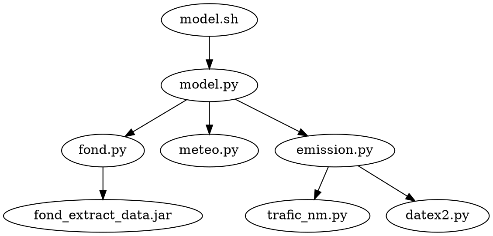

# Model overview

**NB:** The samples directory is located in `docs/samples/`

Call diagram written in graphviz dot:



## model.sh

`model.sh` is a simple shell script that activates the Python virtual environment, and calls `model.py`.

## model.py

`model.py` prepares the SIRANE input files and launches the model.

Execution overview:
- Call the other scripts to create input files in the temporary directory `./sirane/dl_data/`
- Move those files into the configuration directory `./sirane/INPUT/` and edit `./sirane/INPUT/Donnees.dat`
- Change working directory to `./sirane/` and launch the model `./sirane-rev128-etudiants-Linux64`


## meteo.py

`meteo.py` downloads weather data from OpenWeatherMap and writes it to a file in SIRANE format.

When called directly as a script, it prints the file to the terminal.

**NB:** The dates are in UTC

Usage:

```sh
# Print data to terminal
./meteo.py
# Write data to meteo.dat
./meteo.py --file meteo.dat

# Use custom config file
./meto.py --config local/config.ini
```

Sample output file in `samples/meteo.dat`. See also [Meteo file](http://air.ec-lyon.fr/SIRANE/Article.php?Id=SIRANE_File_Meteo&Lang=FR) in SIRANE's documentation.

## fond.py

`fond.py` creates SIRANE's background concentration file based on [Copernicus data](https://ads.atmosphere.copernicus.eu/cdsapp#!/dataset/cams-europe-air-quality-forecasts?tab=overview).

When called as a script, it prints the file to the terminal.

By default, it uses `atmosphere.cdsapi` for Copernicus authentification and not `~/.cdsapirc`.

Execution overview:
- Download the pollution data from Copernicus ADS as a netcdf file
- Launch the `fond_extract_data` Java program to extract the single data point from the file
- Write the data in SIRANE format to the output file

**NB:** Times are in UTC

Usage:

```sh
# Download and print background pollution
./fond.py
# Write data to file
./fond.py --file fond.dat
# Custom java and jar paths if not specified in config.ini
./fond.py --java /path/to/java11 --jar ../fond_extract_data/build/libs/fond_extract_data-all.jar

# Use custom config file
./fond.py […] --config local/config.ini
# Download forecasts up to 36:00 (instead of 24:00)
./fond.py […] --tohour 36
```

Sample data file in `samples/fond.dat`. Sample terminal output in `samples/fond_terminal.txt`. See also [ConcFond file](http://air.ec-lyon.fr/SIRANE/Article.php?Id=SIRANE_File_ConcFond&Lang=FR) in SIRANE's documentation.

## emission.py

`emission.py` creates the SIRANE emission files based on traffic data from `datex2.py` and `trafic_nm.py`.

It uses an emission graph from [CHANGEME].

When called as a script, it prints the file to the terminal.

Execution overview:
- Read mapfiles which map traffic ids to network ids, as well as network lengths file
- Download data from online sources using `datex2.py` or `trafic_nm.py`
- Use the emission graph to compute the emission and assign it to the right network segments using the mapfiles
- Write file to output

Usage:

```sh
# Prints EmisLin file to terminal
./emission.py
```

```py
from emission import main as create_emislin, write_evolemislin
from datetime import datetime, timezone

# Parameters
configfile = "config.ini"
outfile = "emis_lin.dat"
start_time = datetime.now(timezone.utc)
    .replace(minute = 0, second = 0, microsecond = 0)

# Write both files
create_emislin(configfile = configfile, outputfile = outfile)
with open("evol_emis_lin.dat") as f:
    evolemislin_data = [(start_time, "emis_lin.dat", "emis_surf.dat")]
    write_evolemislin(evolemislin_data, file = f)
```

Sample output files in `samples/emis_lin.dat` and `samples/emissions_lin_surf.dat` See also [EmisLin file](http://air.ec-lyon.fr/SIRANE/Article.php?&File=&Id=SIRANE_File_EmisLin&Lang=FR), [EvolEmisLin file](http://air.ec-lyon.fr/SIRANE/Article.php?&File=&Id=SIRANE_File_EvolEmisLin&Lang=FR) and [EvolEmisSurf file](http://air.ec-lyon.fr/SIRANE/Article.php?&File=&Id=SIRANE_File_EvolEmisSurf&Lang=FR) in SIRANE's documentation.

## trafic_nm.py

`trafic_nm.py` downloads a trafic data file from [Open Data Nantes Metropole](https://data.nantesmetropole.fr/explore/dataset/244400404_fluidite-axes-routiers-nantes-metropole/export/)

Usage:

```sh
# Write traffic csv data to trafic_file.csv
./trafic_nm.py --file trafic_file.csv
```

Sample downloaded file in `samples/trafic_nm.csv`.

## datex2.py

`datex2.py` downloads data from from [Info-Routière](http://diffusion-numerique.info-routiere.gouv.fr/toutes-les-dir-a10.html) and convert it to a CSV file.

It specifically fetches the latest traffic data (DataTR) for Nantes.

When called as a script, it writes prints the dat to the terminal.

```sh
# Prints data to terminal
./datex2.py
# Write data to traffic.csv
./datex2.py --file traffic.csv

# Use a custom configuration file
./datex2.py […] --config local/config.ini
# Additionally print DataTRT in csv format to the terminal
./datex2.py […] --trt
```

Sample downloaded file in `samples/datex2.csv`.